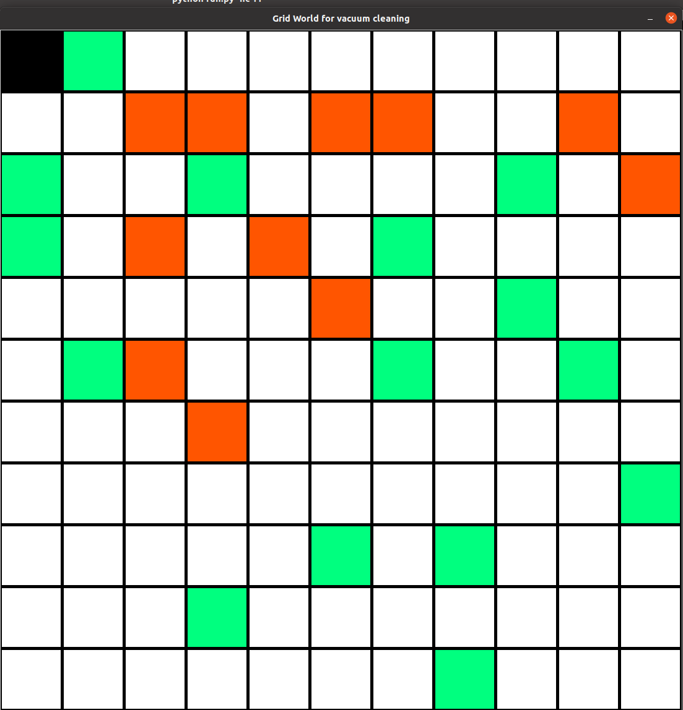

# wasp-AI-ML-m1
Vacuum Cleaning Agent Programming Exercise. 


## Installation

```
conda create --name <env_name> --file requirements.yml
```


## Current status

* [x] Simulator
  * [x] agent in the environment
  * [x] obstacles in the environment
  * [x] dirty in the environment 
  * [ ] .step() render
* [ ] Smart agent 

## Instructions

### Arguments

There is only one argument (`--num_cells`):

```

python run.py --help         
usage: run.py [-h] [--num_cells NUM_CELLS]

Vacuum cleaning smart agent

optional arguments:
  -h, --help            show this help message and exit
  --num_cells NUM_CELLS, -nc NUM_CELLS
                        Grid world's side number of cells

```

The number of side cells can vary within the range `[5,11]`.

So, if one wants to run the training in an environment with 7 grid cells:

```
python run.py --num_cells 7
```

### Usage

After launching the simulator, the user should use the buttons of his mouse:
* button left: it places/removes the robot in/from the environment
* button right: it places/removes obstacles and dirty in/from the environment

**Constraints/assumptions**:

* there is only one robot
* there is a maximum amount of obstacles =  `num_cells`
* there is no maximum limit on the amount of "dirty" but there is minimum (equal to the number of obstacles)
* button left: the user should first place the robot
* button right: then the user must place the obstacles and then the dirty
* nevertheless, the user can remove any object by simply clicking again on the respective occupied cell with the respective button
* reward of hitting against an obstacle: -10
* reward of moving in any direction: -1
* reward of vacuuming one cell with dirty: +1
* the `model` keeps track of the rewards in each cell, where `0` means the robot's location

The user can keep track on the changes on the environment by looking at the logs in the terminal. For instance, an 11-Grid world environment and the respective `model` should look like this: 




Initial `model` representation:


```
[[-1,-1,-1,-1,-1,-1,-1,-1,-1,-1,-1]
 [-1,-1,-1,-1,-1,-1,-1,-1,-1,-1,-1]
 [ 1,-1,-1,-1,-1,-1,-1,-1, 1,-1,-1]
 [ 1,-1,-1,-1,-1,-1, 1,-1,-1,-1,-1]
 [-1,-1,-1,-1,-1,-1,-1,-1, 1,-1,-1]
 [-1,-1,-1,-1,-1,-1, 1,-1,-1, 1,-1]
 [-1,-1,-1,-1,-1,-1,-1,-1,-1,-1,-1]
 [-1,-1,-1,-1,-1,-1,-1,-1,-1,-1, 1]
 [-1,-1,-1,-1,-1,-1,-1, 1,-1,-1,-1]
 [-1,-1,-1,-1,-1,-1,-1,-1,-1,-1,-1]
 [-1,-1,-1,-1,-1,-1,-1, 1,-1,-1,-1]]
```


Final `model` representation:

```
[[ 0, 1,-1, -1, -1, -1,-1,-1,-1,-1,-1]
 [-1,-1,10,-10, -1,-10,10,-1,-1,10,-1]
 [ 1,-1,-1,  1, -1, -1,-1,-1, 1,-1,10]
 [ 1,-1,10, -1,-10, -1, 1,-1,-1,-1,-1]
 [-1,-1,-1, -1, -1,-10,-1,-1, 1,-1,-1]
 [-1, 1,10, -1, -1, -1, 1,-1,-1, 1,-1]
 [-1,-1,-1,-10, -1, -1,-1,-1,-1,-1,-1]
 [-1,-1,-1, -1, -1, -1,-1,-1,-1,-1, 1]
 [-1,-1,-1, -1, -1,  1,-1, 1,-1,-1,-1]
 [-1,-1,-1,  1, -1, -1,-1,-1,-1,-1,-1]
 [-1,-1,-1, -1, -1, -1,-1, 1,-1,-1,-1]]
```


After designing the environment, click `p` to run the training of the smart agent.
